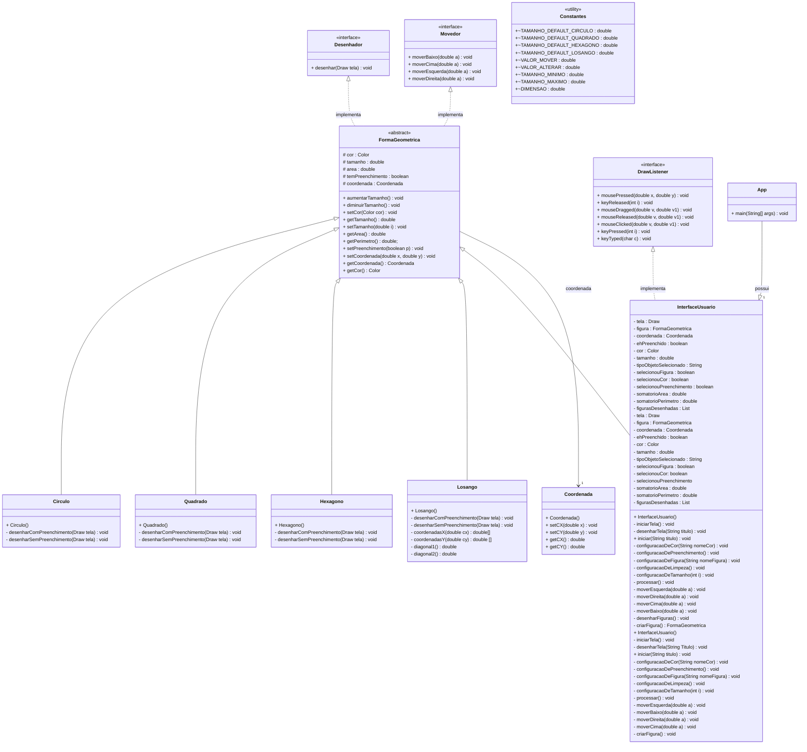

# Lista 4: Aplicativo de desenho vetorial

## Aluno: Igor da Silva
## Engenharia de Telecomunicações - IFSC câmpus São José
## Turma: 129003 - Programação Orientada à Objetos

## Operação

> Para rodar o código, aplique gradle run com o terminal na pasta "lista-4-igor1023";

> Para desenhar uma figura, é necessário escolher a figura, a cor e se possui preenchimento:
Ex.: (F1 ou F2 ou F3 ou F4) e (F5 ou F6 ou F7 ou FO) e (F) => clique em uma posição da tela;

Caso contrário a seguinte mensagem aparecerá no terminal: "Defina as características: FIGURA, COR e POSSUI PREENCHIMENTO"

> Para definir o tamanho da figura (teclas Q ou W), deve-se selecionar uma figura;

> A função de cada opção do MENU também está descrita na classe Constantes.java.

## Comandos - Função de cada tecla

* F1 : Círculo
* F2 : Quadrado
* F3 : Hexágono
* F4 : Losango
* F5 : Vermelho
* F6 : Azul
* F7 : Verde
* F8 : Amarelo
* C  : Limpa o tabuleiro
* F  : Alterna entre figura vazada ou preenchida
* P  : Imprime informações das figuras (área e perímetro total)
* Q  : Diminui tamanho da figura
* W  : Aumenta tamanho da figura
* SETA ESQUERDA ^ : Movimenta as figuras para esquerda
* SETA CIMA     v : Movimenta as figuras para cima
* SETA DIREITA  > : Movimenta as figuras para direita
* SETA BAIXO    < : Movimenta as figuras para baixo

## Diagrama de Classes
